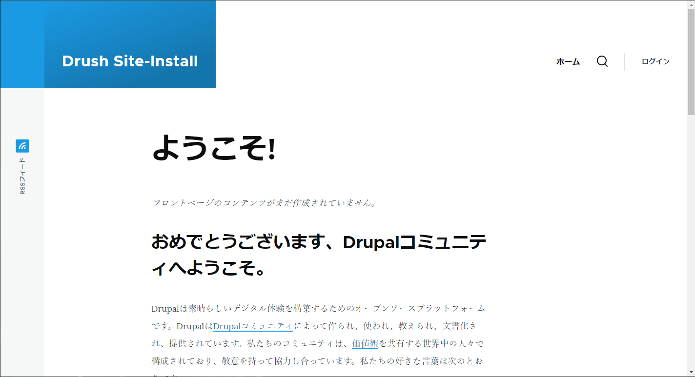

# Drupal10を利用したローカル開発環境のテンプレート

### 前提条件
- 以下のソフトウェアがローカルPC環境(Windows)にインストール済みであること
  - WSL2 + Docker + Git
  - Visual Studo Code + 拡張機能(Dev Containers)

### Dev Containersのイメージ

> [Developing inside a Container](https://code.visualstudio.com/docs/devcontainers/containers) より引用

### テンプレートを試す
1.プロジェクトをクローン、VSCodeを起動

```sh
$ cd {任意のフォルダ}
$ git clone https://github.com/osyaremegane/dev-template-drupal.git
$ cd dev-template-drupal
$ code .
```

2.VSCode上で「Ctrl + Shift + P」を押下、「Reopen in Container」を選択  


3.開発環境が起動後、「Enter」を押下。ターミナル上で「apachectl start」を実行


4.Chromeブラウザを起動、Drupalにアクセス。admin / P@ssw0rdでログイン。  
URL：https://localhost 


### フォルダ/ファイル構成の説明
```
.devcontainer
  apache ： コンテナ内のApacheで利用する自己証明書、設定ファイルを配置
  drupal ： コンテナ内のDrupalで利用する設定ファイルを配置
  php ： コンテナ内のPHPで利用するXDebug用設定ファイルを配置
  scripts ： コンテナビルド時、コンテナ起動時に実行するスクリプトファイルを配置
  devcontainer.json ： Dev Container拡張機能で利用する設定ファイル
  docker-compose.yml ： Dockerコンテナを管理するための設定ファイル
  db.Dockerfile ： データベース用のDockerコンテナ設定ファイル
  web.Dockerfile ： ウェブサーバ用のDockerコンテナ設定ファイル
.gitignore ： 
private : Drupalの設定フォルダ(private)
sync/config ： Drupalの構成ファイル一式(Drush cexコマンドでエクスポートしたもの)
```

### ライセンス
MIT License

Copyright (c) 2024 osyaremegane
